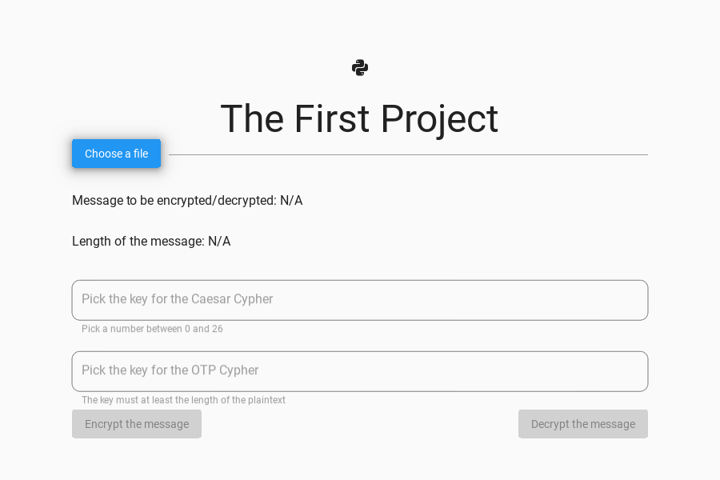
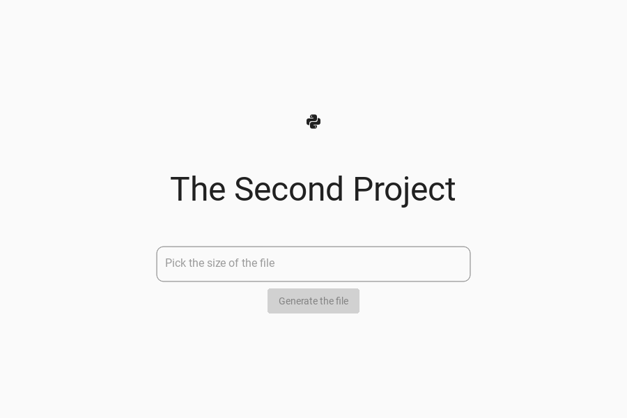

# Cryptography and security projects

> **Original version:** this README and some fixes were added in 2026. To see the project exactly as it was first built, browse commit [`89db34a`](https://github.com/dianapaula19/cryptography-and-security-projects/tree/89db34ae58fab04036fd615b3cbaf962d46cde44) (2021-05-24).

Two desktop apps for the *Cryptography and Security* course at the University of Bucharest
(2021), both written in Python with a Kivy / KivyMD interface.

## 1. Double encryption

Encrypts a text file with two classical ciphers in a row, a **Caesar cipher** followed by a
**one-time pad** (XOR with a key at least as long as the message), and decrypts by applying
them in reverse order. Input and output are files.



## 2. Cryptographically secure random number generator

Generates a binary file of the chosen size (in MB) with the **Blum Blum Shub** generator:
x<sub>i+1</sub> = x<sub>i</sub>² mod n, where n = p·q is a product of two primes congruent to
3 mod 4; each step outputs the parity of x<sub>i+1</sub>, and every 8 bits are packed into one
byte.



Demo videos: [project 1](https://drive.google.com/file/d/1nNVKSwN2l-msLzL5KThIGhydzQKvubyo/view?usp=sharing),
[project 2](https://drive.google.com/file/d/1rkVWLVPkqjFpSLKR78BMJeizgoRvGO5t/view?usp=sharing).
The original assignments (in Romanian) are in each project's `README.ro.md`.

## Running

```bash
cd project-1            # or project-2
python3 -m venv env && source env/bin/activate
pip install -r requirements.txt
python3 main.py
```
